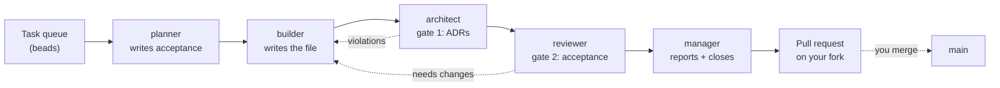

# Actual Factory Demo

Build a working software factory on Claude Code in 15 minutes with Gas City, then watch five agents carry a task from a queue to an open pull request fully autonomously.

## Table of contents

- [Software Factory Overview](#software-factory-overview)
- [Walkthrough](#walkthrough)
  - [1. Install the prerequisites](#1-install-the-prerequisites)
  - [2. Fork this repo](#2-fork-this-repo)
  - [3. Create the factory](#3-create-the-factory)
  - [4. Install the pack](#4-install-the-pack)
  - [5. Seed the task queue](#5-seed-the-task-queue)
  - [6. Run a task](#6-run-a-task)
- [Join our Software Factory Intensive for more!](#join-our-software-factory-intensive-for-more)

## Software Factory Overview

This tutorial uses the [Gas City](https://github.com/gastownhall/gascity) framework to build a complete software factory layer on top of Claude Code. This repo acts as the workspace, or **rig**, that the factory works on. You hand the factory a task, and five agents pass it between themselves until the result lands as a pull request you may review.



The work itself is simply to produce ASCII art for a letter, with a rhyming couplet underneath each. The focus, though, is on understanding how work gets dispatched, who reviews it, and where the quality gates sit.

## Walkthrough

### 1. Install the prerequisites

#### Install

Homebrew runs on both macOS and Linux, and `gascity` declares `bd`, `dolt`, `jq`, `tmux`, and
`flock` as dependencies, so one line covers the whole stack:

```bash
brew install gascity gh git
gh auth login
```

`pgrep` and `lsof` are already present on macOS and on any standard Linux desktop. If you are on
Linux without Homebrew, [the Gas City
README](https://github.com/gastownhall/gascity#installation) covers the source build.

#### Check

```bash
gc version && bd version && dolt version && gh auth status
```

### 2. Fork this repo

**This repo is also the rig.** Your factory writes its output back into a checkout of this same repository. You do need somewhere you can push, though:

```bash
mkdir -p ~/factory-demo && cd ~/factory-demo
gh repo fork actual-software/actual-factory-demo --clone
cd actual-factory-demo && gh repo set-default <your-github-user>/actual-factory-demo && cd ..
```

The `set-default` line matters. In a fresh fork, `gh` resolves the base
repository to the upstream parent, so pull requests the factory opens would land
on `actual-software/actual-factory-demo` instead of your fork.

### 3. Create the factory

```bash
gc init factory
```

`gc init` is interactive and asks two questions:

- Config template: **minimal** (option `2`)
- Provider: **Claude Code** (option `1`)

That writes `factory/`, holding a `city.toml` and a `pack.toml`.

Now start it:

```bash
cd factory && gc start
```

`gc start` registers the city with the supervisor, installs the background service if this is your first city, and brings up the city's Dolt server along with its agents.

**Check:**

```bash
gc cities       # factory, with its absolute path
gc status       # Controller: supervisor-managed (PID ...)
gc doctor       # ✓ pass, ⚠ warning, ✗ error
```

`gc doctor --fix` clears the routine warnings a fresh city reports. Run `gc doctor` again afterwards and you should be down to passes.

The city and the rig live side by side. At this point your directory should look like this:

```text
cd .. && ls
actual-factory-demo/   # your repo fork, which is also the rig
factory/               # the Gas City factory
```

### 4. Install the pack

A **pack** is how Gas City ships agents, formulas, and config as one installable unit. The one for this demo lives in this repo's `factory/` directory — not to be confused with the `factory/` city you just created alongside it.

Register your fork as the rig, then import the pack into it:

```bash
cd factory
export RIG_PATH="$HOME/factory-demo/actual-factory-demo"
gc rig add "$RIG_PATH" --name ascii-art
gc import add --rig ascii-art "$RIG_PATH/factory"
gc restart
```

The rig is named `ascii-art` because that's the work it holds.

The `--rig ascii-art` binds the five agents to the rig, which is what puts them in your fork's checkout when they run. Import without it and the agents come up at city scope, where there's no repo to write to.

**Check:**

```bash
gc import list --rig ascii-art   # factory, with a locked commit
gc formula list --rig ascii-art  # ascii-art, alongside the built-in mol-* formulas
gc status                        # five ascii-art/factory.* agents
```

### 5. Seed the task queue

The agents read work from **beads**, which is a task queue backed by Dolt. Yours is empty right now. The seed script opens two epics and twenty-six tasks, one per letter:

```bash
cd "$RIG_PATH"
./seed.sh
```

**Check:**

```bash
gc bd list --type=epic   # Letters a–m and Letters n–z
gc bd ready              # twenty-six tasks with no blockers
```

### 6. Run a task

Pick a letter, and grab its bead id:

```bash
export BEAD_ID=$(gc bd list --type=task --status=open --limit 0 | grep -E "Implement a\.md$" | awk '{print $2}')
gc bd show "$BEAD_ID"
```

Hand it to the factory:

```bash
gc sling ascii-art/factory.planner "$BEAD_ID" --on ascii-art
```

The breakdown of the command is as follows:

- `ascii-art/factory.planner` names the target agent pool as `<rig>/<pack>.<agent>`
- `$BEAD_ID` is the task
- `--on ascii-art` attaches the formula, which is what tells every agent downstream what runs after it

To watch the agents work, you can simply find a session you'd like to watch and attach to it like so:

```bash
gc session list
gc session attach <session-name> # example: gc session attach ascii-art/factory.planner-1
```

**Note: detach with `Ctrl+b` then `d`.** Never `Ctrl+c`. That one kills the session outright, and you may need to restart the agent or city to resume work.

Once the factory is finished, you will see a PR on the other side that you can inspect and merge:

```bash
gh pr view "$(gc bd show "$BEAD_ID" --json | jq -r '.[0].metadata.pr_url')" --web
gh pr merge <number> --merge
```

You should see a new file at `ascii/a.md`, holding an H1 with the letter, a fenced code block with the art in it, and a two-line rhyme. Those constraints aren't arbitrary. They come from [ADR 0001](./adrs/0001.ADR.ASCII.md), which the agents read as part of their context. You can also run another if you like. Same loop, `b.md` instead of `a.md`.

## Join our Software Factory Intensive for more!

This is a small sample of what is covered in the [Software Factory Intensive](https://www.actual.ai/softwarefactory) hosted by [Actual AI](https://www.actual.ai/) and the team behind Gas City. The intensive covers a wide range of software factory principles, from multi-agent workflows to review gates to self-improvement loops. Have other questions, or want to show off what you built with your factory? Join the [Actual AI User Community Slack](https://join.slack.com/t/actualaiusercommunity/shared_invite/zt-3vibgzapf-ywx0Db29mZ4lhtQJGzZfGQ).
